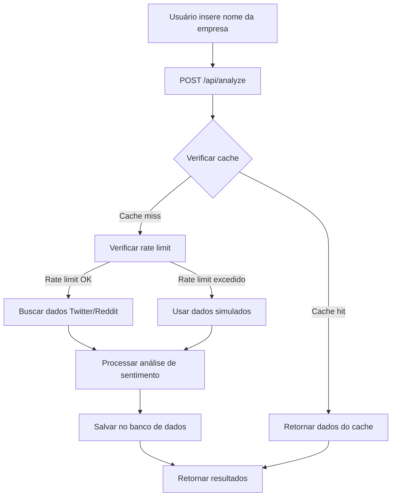
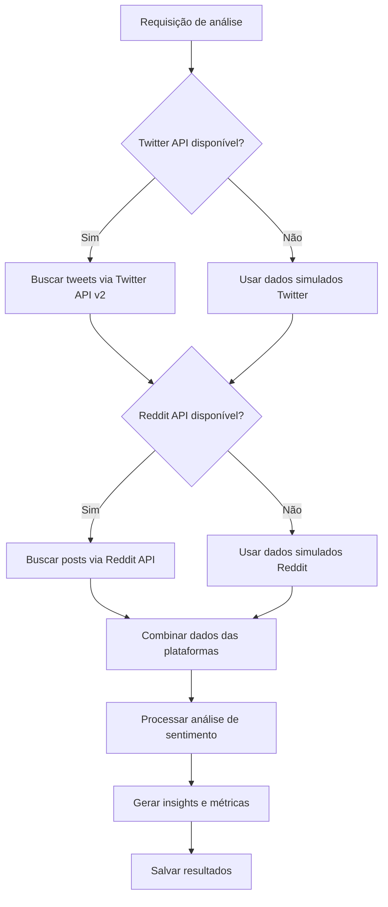

# 🏗️ Documentação Técnica - Voz do Cliente

## Arquitetura da Aplicação

### Visão Geral

A aplicação Voz do Cliente é construída com uma arquitetura moderna baseada em Next.js, seguindo os princípios de:

- **Server-Side Rendering (SSR)** para performance otimizada
- **API Routes** para endpoints backend
- **Componentização** para reutilização de código
- **Tipagem estática** com TypeScript
- **ORM** com Prisma para abstração do banco de dados

### Diagrama de Arquitetura

```
┌─────────────────┐    ┌─────────────────┐    ┌─────────────────┐
│   Frontend      │    │   Backend       │    │   Banco de      │
│   (Next.js)     │◄──►│   (API Routes)  │◄──►│   Dados         │
│                 │    │                 │    │   (PostgreSQL)  │
└─────────────────┘    └─────────────────┘    └─────────────────┘
         │                       │                       │
         │                       │                       │
         ▼                       ▼                       ▼
┌─────────────────┐    ┌─────────────────┐    ┌─────────────────┐
│   Componentes   │    │   APIs Externas │    │   Prisma ORM    │
│   UI/UX         │    │   Twitter/Reddit│    │                 │
└─────────────────┘    └─────────────────┘    └─────────────────┘
```

## Estrutura de Pastas Detalhada

```
app/
├── app/                          # Diretório principal do Next.js 13+
│   ├── analysis/                 # Página de análise detalhada
│   │   └── [id]/                # Rota dinâmica para análise específica
│   │       └── page.tsx         # Página de análise individual
│   ├── api/                     # Endpoints da API
│   │   ├── analyze/             # Endpoint principal de análise
│   │   │   └── route.ts         # POST /api/analyze
│   │   ├── analysis/            # Endpoints de análises
│   │   │   └── [id]/           # Análise específica
│   │   │       ├── route.ts    # GET/DELETE /api/analysis/[id]
│   │   │       └── pdf/        # Geração de PDF
│   │   │           └── route.ts # GET /api/analysis/[id]/pdf
│   │   └── history/            # Histórico de análises
│   │       └── route.ts        # GET /api/history
│   ├── history/                # Página de histórico
│   │   └── page.tsx           # Lista de análises anteriores
│   ├── globals.css            # Estilos globais
│   ├── layout.tsx             # Layout principal da aplicação
│   └── page.tsx               # Página inicial (dashboard)
├── components/                 # Componentes React reutilizáveis
│   ├── ui/                    # Componentes base da interface
│   │   ├── button.tsx         # Componente de botão
│   │   ├── card.tsx           # Componente de cartão
│   │   ├── input.tsx          # Componente de input
│   │   └── ...                # Outros componentes UI
│   ├── competitor-chart.tsx   # Gráfico de comparação com concorrentes
│   ├── engagement-chart.tsx   # Gráfico de engajamento
│   ├── sentiment-chart.tsx    # Gráfico de análise de sentimento
│   ├── theme-provider.tsx     # Provedor de tema (dark/light)
│   └── tweets-list.tsx        # Lista de tweets/posts
├── hooks/                     # Custom React Hooks
│   └── use-toast.ts          # Hook para notificações toast
├── lib/                      # Utilitários e configurações
│   ├── db/                   # Configurações específicas do banco
│   ├── db.ts                 # Cliente Prisma configurado
│   ├── pdf-generator.ts      # Geração de relatórios PDF
│   ├── sentiment-analyzer.ts # Análise de sentimento
│   ├── types.ts              # Definições de tipos TypeScript
│   └── utils.ts              # Funções utilitárias
├── prisma/                   # Configuração do banco de dados
│   └── schema.prisma         # Schema do banco de dados
├── package.json              # Dependências e scripts
├── next.config.js            # Configuração do Next.js
├── tailwind.config.ts        # Configuração do Tailwind CSS
├── tsconfig.json             # Configuração do TypeScript
└── .env.example              # Exemplo de variáveis de ambiente
```

## APIs e Endpoints

### Endpoint Principal: Análise de Sentimento

**POST /api/analyze**

Realiza análise de sentimento para uma empresa específica.

```typescript
// Request
interface AnalyzeRequest {
  companyName: string;
}

// Response
interface AnalyzeResponse {
  id: string;
  companyName: string;
  totalTweets: number;
  positiveTweets: number;
  negativeTweets: number;
  neutralTweets: number;
  sentimentScore: number;
  engagementRate: number;
  reachEstimate: number;
  topTopics: string[];
  competitors: CompetitorData[];
  insights: string[];
  tweets: TweetData[];
  isRealData: boolean;
  errorMessage?: string;
}
```

**Exemplo de uso:**
```bash
curl -X POST http://localhost:3000/api/analyze \
  -H "Content-Type: application/json" \
  -d '{"companyName": "MinhaEmpresa"}'
```

### Endpoints de Análises

**GET /api/analysis/[id]**

Recupera uma análise específica por ID.

```typescript
// Response
interface AnalysisResponse {
  id: string;
  company: {
    id: string;
    name: string;
  };
  totalTweets: number;
  sentimentScore: number;
  // ... outros campos da análise
  tweets: TweetData[];
  createdAt: string;
  updatedAt: string;
}
```

**DELETE /api/analysis/[id]**

Remove uma análise específica.

**GET /api/analysis/[id]/pdf**

Gera e retorna um relatório PDF da análise.

### Endpoint de Histórico

**GET /api/history**

Lista todas as análises realizadas.

```typescript
// Response
interface HistoryResponse {
  analyses: {
    id: string;
    company: {
      name: string;
    };
    totalTweets: number;
    sentimentScore: number;
    createdAt: string;
  }[];
}
```

## Banco de Dados

### Schema do Banco (Prisma)

```prisma
model Company {
  id        String   @id @default(cuid())
  name      String   @unique
  createdAt DateTime @default(now())
  updatedAt DateTime @updatedAt
  
  analyses Analysis[]
  
  @@map("companies")
}

model Analysis {
  id          String   @id @default(cuid())
  companyId   String
  company     Company  @relation(fields: [companyId], references: [id], onDelete: Cascade)
  
  totalTweets    Int      @default(0)
  positiveTweets Int      @default(0)
  negativeTweets Int      @default(0)
  neutralTweets  Int      @default(0)
  
  sentimentScore Float    @default(0.0)
  engagementRate Float    @default(0.0)
  reachEstimate  Int      @default(0)
  
  topTopics      Json     @default("[]")
  competitors    Json     @default("[]")
  insights       Json     @default("[]")
  
  createdAt DateTime @default(now())
  updatedAt DateTime @updatedAt
  
  tweets Tweet[]
  
  @@map("analyses")
}

model Tweet {
  id         String   @id @default(cuid())
  analysisId String
  analysis   Analysis @relation(fields: [analysisId], references: [id], onDelete: Cascade)
  
  tweetId    String   @unique
  content    String
  author     String
  sentiment  String   // positive, negative, neutral
  score      Float    @default(0.0)
  likes      Int      @default(0)
  retweets   Int      @default(0)
  replies    Int      @default(0)
  
  createdAt DateTime @default(now())
  
  @@map("tweets")
}
```

### Relacionamentos

- **Company** → **Analysis**: Um para muitos (uma empresa pode ter várias análises)
- **Analysis** → **Tweet**: Um para muitos (uma análise contém vários tweets)
- **Cascade Delete**: Ao deletar uma empresa, todas as análises são removidas; ao deletar uma análise, todos os tweets são removidos

### Índices e Performance

```sql
-- Índices recomendados para performance
CREATE INDEX idx_companies_name ON companies(name);
CREATE INDEX idx_analyses_company_id ON analyses(company_id);
CREATE INDEX idx_analyses_created_at ON analyses(created_at DESC);
CREATE INDEX idx_tweets_analysis_id ON tweets(analysis_id);
CREATE INDEX idx_tweets_sentiment ON tweets(sentiment);
CREATE INDEX idx_tweets_created_at ON tweets(created_at DESC);
```

## Fluxo de Dados

### 1. Fluxo de Análise de Sentimento



### 2. Fluxo de Integração com APIs Externas



### 3. Processamento de Sentimento

```typescript
// Algoritmo de análise de sentimento
interface SentimentAnalysis {
  score: number;      // -1 (negativo) a 1 (positivo)
  magnitude: number;  // 0 a 1 (intensidade)
  sentiment: 'positive' | 'negative' | 'neutral';
}

function analyzeSentiment(text: string): SentimentAnalysis {
  // 1. Pré-processamento do texto
  const cleanText = preprocessText(text);
  
  // 2. Análise lexical com dicionário de sentimentos
  const lexicalScore = analyzeLexical(cleanText);
  
  // 3. Análise contextual (negações, intensificadores)
  const contextualScore = analyzeContext(cleanText, lexicalScore);
  
  // 4. Classificação final
  return classifySentiment(contextualScore);
}
```

## Componentes Principais

### 1. Dashboard Principal (page.tsx)

```typescript
// Componente principal que orquestra a análise
export default function Dashboard() {
  const [analysis, setAnalysis] = useState<AnalysisData | null>(null);
  const [loading, setLoading] = useState(false);
  
  const handleAnalyze = async (companyName: string) => {
    setLoading(true);
    try {
      const response = await fetch('/api/analyze', {
        method: 'POST',
        headers: { 'Content-Type': 'application/json' },
        body: JSON.stringify({ companyName })
      });
      const data = await response.json();
      setAnalysis(data);
    } catch (error) {
      console.error('Erro na análise:', error);
    } finally {
      setLoading(false);
    }
  };
  
  return (
    <div className="dashboard">
      <SearchForm onSubmit={handleAnalyze} loading={loading} />
      {analysis && <AnalysisResults data={analysis} />}
    </div>
  );
}
```

### 2. Gráficos de Visualização

```typescript
// Componente de gráfico de sentimento usando Plotly
export function SentimentChart({ data }: { data: AnalysisData }) {
  const chartData = {
    values: [data.positiveTweets, data.negativeTweets, data.neutralTweets],
    labels: ['Positivo', 'Negativo', 'Neutro'],
    type: 'pie' as const,
    marker: {
      colors: ['#10B981', '#EF4444', '#6B7280']
    }
  };
  
  return (
    <Plot
      data={[chartData]}
      layout={{
        title: 'Distribuição de Sentimentos',
        showlegend: true
      }}
      config={{ responsive: true }}
    />
  );
}
```

### 3. Gerador de PDF

```typescript
// Serviço de geração de relatórios PDF
export class PDFGenerator {
  static async generateReport(analysis: AnalysisData): Promise<Buffer> {
    const doc = new PDFDocument();
    
    // Cabeçalho
    doc.fontSize(20).text('Relatório de Análise de Sentimento', 50, 50);
    doc.fontSize(14).text(`Empresa: ${analysis.company.name}`, 50, 80);
    
    // Métricas principais
    doc.text(`Total de menções: ${analysis.totalTweets}`, 50, 120);
    doc.text(`Score de sentimento: ${(analysis.sentimentScore * 100).toFixed(1)}%`, 50, 140);
    
    // Gráficos (implementar com canvas ou imagens)
    await this.addCharts(doc, analysis);
    
    // Insights
    doc.addPage();
    doc.fontSize(16).text('Principais Insights:', 50, 50);
    analysis.insights.forEach((insight, index) => {
      doc.fontSize(12).text(`${index + 1}. ${insight}`, 50, 80 + (index * 20));
    });
    
    return doc;
  }
}
```

## Configurações de Performance

### 1. Otimizações do Next.js

```javascript
// next.config.js
/** @type {import('next').NextConfig} */
const nextConfig = {
  // Otimizações de build
  swcMinify: true,
  compress: true,
  
  // Otimizações de imagem
  images: {
    domains: ['pbs.twimg.com', 'abs.twimg.com'],
    formats: ['image/webp', 'image/avif'],
  },
  
  // Headers de segurança
  async headers() {
    return [
      {
        source: '/(.*)',
        headers: [
          {
            key: 'X-Frame-Options',
            value: 'DENY',
          },
          {
            key: 'X-Content-Type-Options',
            value: 'nosniff',
          },
          {
            key: 'Referrer-Policy',
            value: 'origin-when-cross-origin',
          },
        ],
      },
    ];
  },
  
  // Configurações experimentais
  experimental: {
    serverComponentsExternalPackages: ['@prisma/client'],
  },
};

module.exports = nextConfig;
```

### 2. Cache e Rate Limiting

```typescript
// Sistema de cache em memória
class CacheManager {
  private static cache = new Map<string, CacheEntry>();
  private static readonly TTL = 15 * 60 * 1000; // 15 minutos
  
  static get(key: string): CacheEntry | null {
    const entry = this.cache.get(key);
    if (!entry) return null;
    
    if (Date.now() - entry.timestamp > this.TTL) {
      this.cache.delete(key);
      return null;
    }
    
    return entry;
  }
  
  static set(key: string, data: any, isRealData: boolean): void {
    this.cache.set(key, {
      data,
      timestamp: Date.now(),
      isRealData
    });
  }
}

// Rate limiting por plataforma
class RateLimiter {
  private static limits = new Map<string, RateLimitInfo>();
  
  static checkLimit(platform: string, maxRequests: number, windowMs: number): boolean {
    const now = Date.now();
    const limit = this.limits.get(platform) || { count: 0, windowStart: now };
    
    // Reset window if expired
    if (now - limit.windowStart > windowMs) {
      limit.count = 0;
      limit.windowStart = now;
    }
    
    if (limit.count >= maxRequests) {
      return false;
    }
    
    limit.count++;
    this.limits.set(platform, limit);
    return true;
  }
}
```

## Segurança

### 1. Validação de Entrada

```typescript
// Validação com Zod
import { z } from 'zod';

const AnalyzeRequestSchema = z.object({
  companyName: z.string()
    .min(1, 'Nome da empresa é obrigatório')
    .max(100, 'Nome muito longo')
    .regex(/^[a-zA-Z0-9\s\-_]+$/, 'Caracteres inválidos')
});

export function validateAnalyzeRequest(data: unknown) {
  return AnalyzeRequestSchema.parse(data);
}
```

### 2. Sanitização de Dados

```typescript
// Sanitização de conteúdo de tweets/posts
export function sanitizeContent(content: string): string {
  return content
    .replace(/<script\b[^<]*(?:(?!<\/script>)<[^<]*)*<\/script>/gi, '') // Remove scripts
    .replace(/[<>]/g, '') // Remove HTML tags
    .substring(0, 500) // Limita tamanho
    .trim();
}
```

### 3. Configurações de CORS

```typescript
// Configuração de CORS para APIs
export function corsMiddleware(req: NextRequest) {
  const origin = req.headers.get('origin');
  const allowedOrigins = [
    'https://voz-cliente.empresa.com',
    'http://localhost:3000'
  ];
  
  if (allowedOrigins.includes(origin || '')) {
    return new Response(null, {
      status: 200,
      headers: {
        'Access-Control-Allow-Origin': origin || '',
        'Access-Control-Allow-Methods': 'GET, POST, DELETE, OPTIONS',
        'Access-Control-Allow-Headers': 'Content-Type, Authorization',
      },
    });
  }
  
  return new Response('CORS not allowed', { status: 403 });
}
```

## Monitoramento e Logs

### 1. Sistema de Logs

```typescript
// Logger personalizado
class Logger {
  static info(message: string, meta?: any) {
    console.log(`[INFO] ${new Date().toISOString()} - ${message}`, meta);
  }
  
  static error(message: string, error?: Error, meta?: any) {
    console.error(`[ERROR] ${new Date().toISOString()} - ${message}`, {
      error: error?.message,
      stack: error?.stack,
      ...meta
    });
  }
  
  static warn(message: string, meta?: any) {
    console.warn(`[WARN] ${new Date().toISOString()} - ${message}`, meta);
  }
}
```

### 2. Métricas de Performance

```typescript
// Middleware para medir performance
export function performanceMiddleware(req: NextRequest) {
  const start = Date.now();
  
  return new Promise((resolve) => {
    // Processar requisição
    const duration = Date.now() - start;
    
    Logger.info('Request processed', {
      method: req.method,
      url: req.url,
      duration: `${duration}ms`
    });
    
    resolve(null);
  });
}
```

## Testes

### 1. Testes Unitários

```typescript
// Exemplo de teste para análise de sentimento
import { analyzeSentiment } from '../lib/sentiment-analyzer';

describe('Sentiment Analyzer', () => {
  test('should classify positive sentiment', () => {
    const result = analyzeSentiment('Adorei o produto! Muito bom!');
    expect(result.sentiment).toBe('positive');
    expect(result.score).toBeGreaterThan(0.5);
  });
  
  test('should classify negative sentiment', () => {
    const result = analyzeSentiment('Produto terrível, não recomendo');
    expect(result.sentiment).toBe('negative');
    expect(result.score).toBeLessThan(-0.5);
  });
});
```

### 2. Testes de Integração

```typescript
// Teste de endpoint de análise
import { POST } from '../app/api/analyze/route';

describe('/api/analyze', () => {
  test('should return analysis for valid company', async () => {
    const request = new Request('http://localhost:3000/api/analyze', {
      method: 'POST',
      body: JSON.stringify({ companyName: 'TestCompany' }),
      headers: { 'Content-Type': 'application/json' }
    });
    
    const response = await POST(request);
    const data = await response.json();
    
    expect(response.status).toBe(200);
    expect(data).toHaveProperty('id');
    expect(data).toHaveProperty('sentimentScore');
  });
});
```

## Próximos Passos

Para expandir a aplicação:

1. **Implementar autenticação** com NextAuth.js
2. **Adicionar mais plataformas** (Instagram, LinkedIn, TikTok)
3. **Implementar análise em tempo real** com WebSockets
4. **Adicionar machine learning** para melhor análise de sentimento
5. **Criar dashboard administrativo** para gerenciar usuários e configurações
6. **Implementar notificações** por email/SMS para alertas
7. **Adicionar exportação** para Excel/CSV
8. **Implementar API pública** com autenticação por token

## Referências Técnicas

- [Next.js Documentation](https://nextjs.org/docs)
- [Prisma Documentation](https://www.prisma.io/docs)
- [TypeScript Handbook](https://www.typescriptlang.org/docs)
- [Tailwind CSS Documentation](https://tailwindcss.com/docs)
- [Twitter API v2 Documentation](https://developer.twitter.com/en/docs/twitter-api)
- [Reddit API Documentation](https://www.reddit.com/dev/api)
